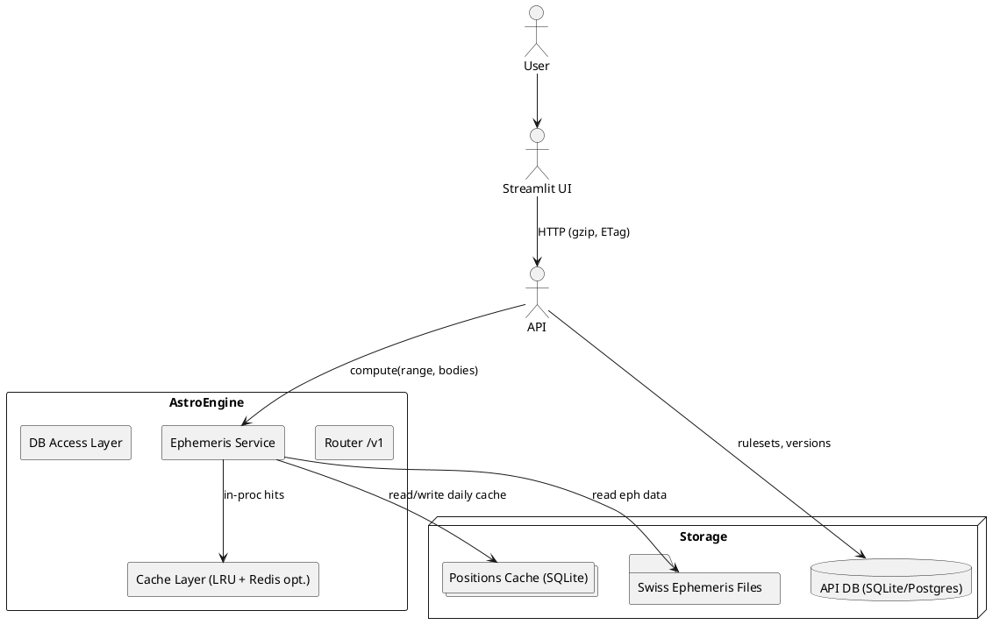

# AstroEngine High-Level Architecture

This document captures the current top-level service layout for AstroEngine, emphasizing the module → submodule → channel → subchannel boundaries that keep the astrology computation stack organized and upgrade-friendly. Each component corresponds to data-backed workflows that strictly source information from maintained datasets (Solar Fire exports, Swiss Ephemeris files, SQLite caches, and related rulesets) to preserve integrity across natal, mundane, and tracking contexts.

The diagram distinguishes the request/response flow from the storage subsystems, showing how the ephemeris service mediates every calculation by pulling deterministic data from the indexed Swiss Ephemeris catalogues, cached daily positions, and the broader AstroEngine ruleset database. Modules and submodules expose channels and subchannels that feed this pipeline, ensuring any upgrades or new datasets slot into the hierarchy without displacing existing functionality.
