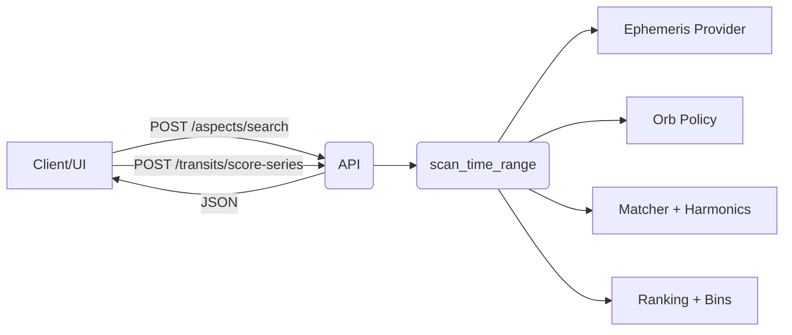

# Aspect Engine & Policies

This page explains how to use the **Aspect Search** and **Severity Series** endpoints, and how **Orb Policies** affect results.

## Architecture



### Data flow

1. **Request validation** — payloads are parsed via [`AspectSearchRequest`](../app/schemas/aspects.py) to ensure time windows, objects, and paging flags are valid before any computation runs.【F:app/schemas/aspects.py†L32-L111】
2. **Time scanning** — [`scan_time_range`](../app/routers/aspects.py) orchestrates the window sampling, calling the configured ephemeris provider for positions and emitting raw hits with angular metadata.【F:app/routers/aspects.py†L102-L150】
3. **Matching & harmonics** — [`matcher`](../astroengine/core/aspects_plus/matcher.py) compares separations against the base angles declared in [`harmonics`](../astroengine/core/aspects_plus/harmonics.py), applying harmonic expansions where requested.【F:astroengine/core/aspects_plus/matcher.py†L1-L200】【F:astroengine/core/aspects_plus/harmonics.py†L1-L122】
4. **Ranking & binning** — [`rank_hits`](../astroengine/core/aspects_plus/aggregate.py) transforms hits into API-ready dictionaries, evaluates severity weights via [`scan_plus.ranking`](../astroengine/core/scan_plus/ranking.py), then aggregates them into daily bins for histograms.【F:astroengine/core/aspects_plus/aggregate.py†L33-L108】【F:astroengine/core/scan_plus/ranking.py†L1-L124】
5. **Response DTOs** — hits, bins, and paging information are serialized through [`AspectSearchResponse`](../app/schemas/aspects.py) so the JSON matches the documented schema.【F:app/schemas/aspects.py†L67-L111】
6. **Orb policy resolution** — inline values win; otherwise IDs are resolved through the [Orb Policy CRUD router](../app/routers/policies.py) and repository helpers in [`app.repo.orb_policies`](../app/repo/orb_policies.py).【F:app/routers/aspects.py†L40-L103】【F:app/routers/policies.py†L2-L74】【F:app/repo/orb_policies.py†L1-L8】

## Key modules

* [`astroengine/core/aspects_plus/harmonics.py`](../astroengine/core/aspects_plus/harmonics.py) — base & harmonic aspect angles.【F:astroengine/core/aspects_plus/harmonics.py†L1-L122】
* [`astroengine/core/aspects_plus/matcher.py`](../astroengine/core/aspects_plus/matcher.py) — angular separation → named aspect mapping.【F:astroengine/core/aspects_plus/matcher.py†L1-L200】
* [`app/routers/aspects.py`](../app/routers/aspects.py) — window scanning + pagination orchestration for `/aspects/search`.【F:app/routers/aspects.py†L102-L150】
* [`astroengine/core/aspects_plus/aggregate.py`](../astroengine/core/aspects_plus/aggregate.py) — ranking, day bins, pagination utilities.【F:astroengine/core/aspects_plus/aggregate.py†L33-L108】
* [`astroengine/core/scan_plus/ranking.py`](../astroengine/core/scan_plus/ranking.py) — severity scoring & composites.【F:astroengine/core/scan_plus/ranking.py†L1-L124】
* [`app/schemas/aspects.py`](../app/schemas/aspects.py) — request/response DTOs for `/aspects/search`.【F:app/schemas/aspects.py†L9-L111】
* [`app/routers/policies.py`](../app/routers/policies.py) — OrbPolicy CRUD endpoints for managed configurations.【F:app/routers/policies.py†L2-L74】

## Quickstart: Find aspects in a window

```bash
curl -s http://localhost:8000/aspects/search \
 -H 'Content-Type: application/json' \
 -d '{
  "objects": ["Sun", "Moon", "Mars", "Venus"],
  "aspects": ["sextile", "trine", "square"],
  "harmonics": [5,7,13],
  "window": {"start": "2025-01-01T00:00:00Z", "end": "2025-03-01T00:00:00Z"},
  "step_minutes": 60,
  "order_by": "time",
  "limit": 200,
  "orb_policy_inline": {
    "per_aspect": {"sextile": 3.0, "square": 6.0, "trine": 6.0},
    "adaptive_rules": {"luminaries_factor": 0.9, "outers_factor": 1.1}
  }
 }' | jq '.hits[0], .bins[0], .paging'
```

Response snippets:

* `hits[]`: `{ a, b, aspect, harmonic, exact_time, orb, orb_limit, severity, meta }`
* `bins[]`: `{ date, count, score }` (UTC)
* `paging`: `{ limit, offset, total }`

### Validating hit payloads

Each hit includes the raw orb, the resolved limit, and the severity computed with cosine tapering from [`taper_by_orb`](../astroengine/core/scan_plus/ranking.py).【F:astroengine/core/scan_plus/ranking.py†L22-L39】 Inspect the `meta.angle` value to confirm which harmonic or base aspect produced the match.【F:astroengine/core/aspects_plus/aggregate.py†L36-L52】

## Daily & Monthly Severity Series

Use the `/transits/score-series` endpoint when you need composites instead of the full hit list.

Compute series directly from a fresh scan:

```bash
curl -s http://localhost:8000/transits/score-series \
 -H 'Content-Type: application/json' \
 -d '{
  "scan": {
    "objects": ["Mars","Venus"],
    "aspects": ["sextile"],
    "window": {"start": "2025-01-01T00:00:00Z", "end": "2025-02-10T00:00:00Z"},
    "step_minutes": 60,
    "orb_policy_inline": {"per_aspect": {"sextile": 3.0}}
  }
 }' | jq '.daily[:3], .monthly'
```

Or feed your own curated hits (for example, filtered client-side):

```bash
curl -s http://localhost:8000/transits/score-series \
 -H 'Content-Type: application/json' \
 -d '{
  "hits": [
    {"a":"Mars","b":"Venus","aspect":"sextile","exact_time":"2025-01-15T12:00:00Z","orb":0.2,"orb_limit":3.0,"severity":0.6}
  ]
 }' | jq
```

Under the hood, the service maps each hit into an [`EventPoint`](../astroengine/core/scan_plus/ranking.py) and computes daily/monthly composites with [`daily_composite`](../astroengine/core/scan_plus/ranking.py) and [`monthly_composite`](../astroengine/core/scan_plus/ranking.py).【F:astroengine/core/scan_plus/ranking.py†L90-L124】 Provide `severity` when posting precomputed hits so aggregation does not need to re-score them.

## Orb Policies

You can supply an orb policy in two ways:

1. **Inline JSON** — useful for experiments or ephemeral requests:

   ```json
   {
     "per_object": {"Sun": 8.0, "Moon": 6.0},
     "per_aspect": {"conjunction": 8.0, "sextile": 3.0},
     "adaptive_rules": {"luminaries_factor": 0.9, "outers_factor": 1.1}
   }
   ```

2. **By ID** — persist shared policies via the OrbPolicy CRUD API:

   ```bash
   curl -s http://localhost:8000/policies | jq
   curl -s -X POST http://localhost:8000/policies \
    -H 'Content-Type: application/json' \
    -d '{"name":"classic","per_aspect":{"sextile":3.0}}'
   ```

Resolution precedence inside the engine:

* `orb_policy_inline.per_object` overrides everything else for matching bodies.
* `orb_policy_inline.per_aspect` (or stored policy defaults) are next.
* Built-in defaults from [`DEFAULT_POLICY`](../app/routers/aspects.py) cover any unspecified aspect family.【F:app/routers/aspects.py†L40-L74】
* Adaptive multipliers (e.g., `luminaries_factor`) are applied last to fine-tune limits.【F:astroengine/core/aspects_plus/orb_policy.py†L1-L72】

If you pass `orb_policy_id` but the DB repositories are not wired, the API returns `400` with guidance to use `orb_policy_inline` instead.【F:app/routers/aspects.py†L67-L103】

## Harmonics

* Provide integers in `harmonics[]`; angles expand to `k × (360° / h)` for `k = 1..⌊h/2⌋` within `(0°, 180°]`. The helper in [`harmonics.py`](../astroengine/core/aspects_plus/harmonics.py) handles deduplication and naming.【F:astroengine/core/aspects_plus/harmonics.py†L42-L122】
* Named aspects from `aspects[]` merge with harmonic-derived angles; duplicates collapse before matching so you do not see double hits for the same geometry.【F:astroengine/core/aspects_plus/matcher.py†L64-L143】
* Severe or rare harmonics may require tighter `step_minutes` so the root-finding refinement sees the narrow orb window.

## Performance Tips

* Start with `step_minutes=60` for windows spanning weeks or months; tighten to `15–30` only when you need precise ingress timing. The scanner still performs bisection near hits to refine timestamps.【F:app/routers/aspects.py†L102-L150】
* Restrict `objects[]` or supply explicit `pairs` to avoid `O(n²)` combinations when scanning many bodies.【F:app/schemas/aspects.py†L34-L47】
* Use `limit`/`offset` pagination and the `order_by` switch (`time`, `severity`, `orb`) to browse large result sets efficiently.【F:app/schemas/aspects.py†L49-L62】
* When aggregating series, trim payloads to the hits you truly need—`daily_composite` and `monthly_composite` scale with the number of events rather than the raw window.【F:astroengine/core/scan_plus/ranking.py†L90-L124】

## Troubleshooting

* **Empty results** — confirm the ephemeris provider is configured; `_get_provider` in the aspects router raises `RuntimeError` if not injected at startup.【F:app/routers/aspects.py†L17-L38】
* **Time zones** — the API normalizes times to UTC; always send ISO-8601 timestamps with a `Z` suffix or explicit offset.【F:app/schemas/aspects.py†L9-L33】
* **Out-of-orb hits** — double-check your `per_aspect` and `per_object` limits; the matcher enforces whichever threshold resolves after adaptive scaling.【F:astroengine/core/aspects_plus/orb_policy.py†L1-L72】
* **Policy lookups** — `orb_policy_id` requires the SQLAlchemy session helpers under `app.db`; run the migration stack to populate the `orb_policies` table before relying on stored IDs.【F:app/routers/policies.py†L13-L74】
